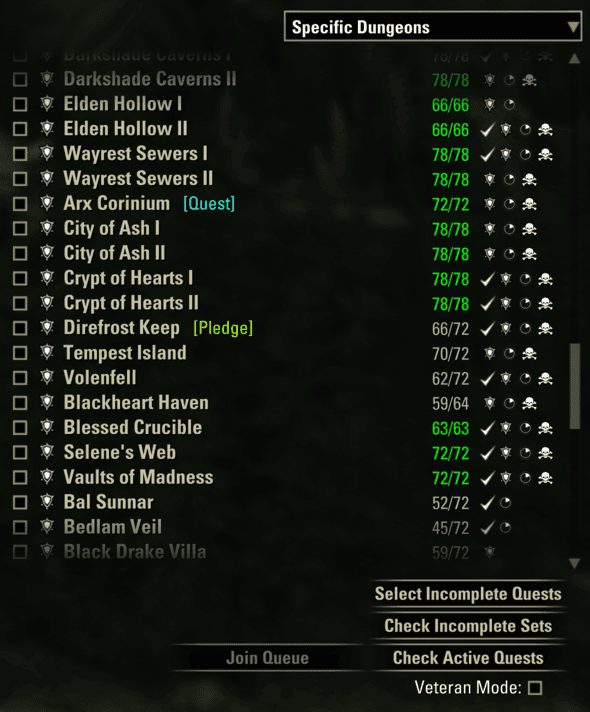
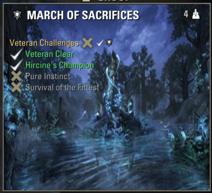
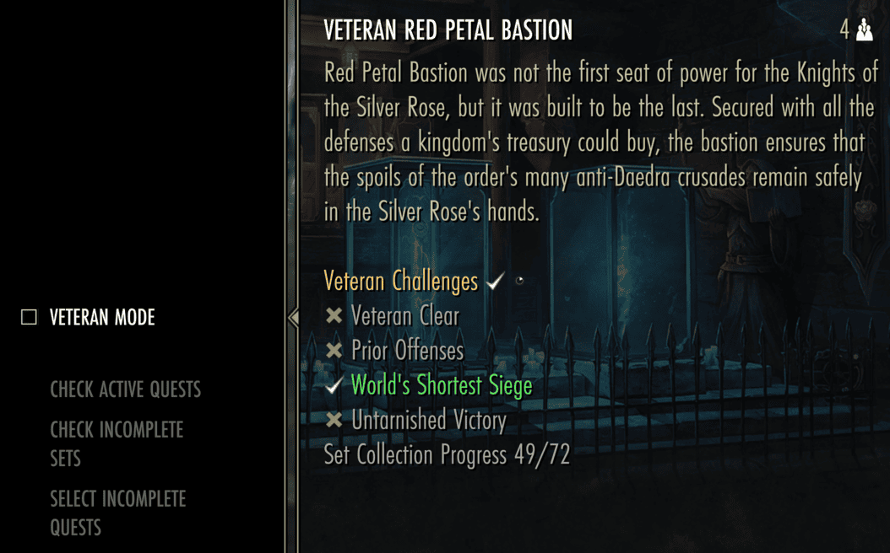

# Activity Finder Plus

Enhanced Activity Finder and LFG tools for The Elder Scrolls Online.

| | Name |
|---|---|
| ESOUI | **FirewoodDoge** |
| GitHub | **[sivaDog](https://github.com/sivaDog)** |

## Screenshots

### Dungeon list (keyboard)

Pledge tags, set collection progress, and achievement icons on every row. Quick-select buttons and a Veteran Mode toggle sit below the list.

### Achievement details (keyboard)

Hover a dungeon to see veteran challenge progress — clear, hard mode, speed run, and no-death — in the tooltip or a separate window (configurable).

### Quick Select (gamepad)

Open the Quick Select menu from the dungeon finder to toggle Veteran Mode, run pledge/set/quest filters, and read challenge status in the description panel.

## Features

### Ready check
- Louder, repeating sound notifications
- Large on-screen alert
- Auto-accept (optional, `/afp`)
- Configurable sound repeat delay

### Activity Finder (keyboard)
- Daily pledge and quest status on dungeon rows
- Set collection progress per dungeon (requires [LibSets](https://www.esoui.com/downloads/info2241-LibSets.html))
- Achievement icons for veteran hard mode, trifecta, and no-death runs
- Veteran challenge checklist in the dungeon tooltip (or a separate window to avoid overlap with other addons)
- Quick-select buttons:
  - **Check Active Quests** — incomplete pledges in your journal
  - **Select Incomplete Quests** — skill point quests not yet completed on this character
  - **Check Incomplete Sets** — unfinished set collection (requires LibSets)
- **Veteran Mode** checkbox — quick-select targets normal or veteran dungeons

### Activity Finder (gamepad)
- Veteran challenge list in the dungeon description panel
- **Quick Select** dialog — pledge, set, and quest filters with Veteran Mode toggle
- Assign under **Settings > Controls > Activity Finder**, or use `/afpqs` (active only in the dungeon finder)

### Other
- Auto-release in battlegrounds (optional)
- Daily pledge summary in chat (`/pledge`, `/pl`)
- Leave group (`/leave`, `/lv`)

## Slash commands

| Command | Action |
|---|---|
| `/afp` | Open settings |
| `/afpqs` | Open gamepad Quick Select (dungeon finder only) |
| `/pledge` `/pl` | Print today's pledges |
| `/leave` `/lv` | Leave group |

## Requirements

- [LibAddonMenu-2.0](https://www.esoui.com/downloads/info7-LibAddonMenu-2.0.html) (>= 43)
- [LibUndauntedPledges](https://www.esoui.com/downloads/info3314-LibUndauntedPledges.html)
- [LibSets](https://www.esoui.com/downloads/info2241-LibSets.html) (optional — set collection progress)

## Installation

1. Install dependencies via Minion or manually from ESOUI.
2. Copy the `ActivityFinderPlus` folder into your `AddOns` directory.
3. Enable the addon in the in-game Add-ons menu.

Settings: `/afp`

## Upgrading from Group Synergizer

Saved settings are imported automatically on first load from `GroupSynergizerSavedVars`. You can remove the old addon after confirming your settings migrated.

## Compatibility

- **Bandits User Interface** (optional): when installed, Activity Finder Plus hides its `BUI_AutoQueue` control on the group finder scene to avoid overlapping UI. It is an optional soft dependency and is not required.

## Credits

- **Author:** FirewoodDoge ([GitHub: sivaDog](https://github.com/sivaDog))
- **UI helpers:** Modified code from [Bandits User Interface](https://www.esoui.com/downloads/info1643-BanditsUserInterface.html) by Hoft, secretrob

## Development note

This addon was developed with the help of an AI coding assistant. The author reviews and tests the code before release.

## Feedback

GitHub: [Issues](https://github.com/sivaDog/ActivityFinderPlus/issues)
